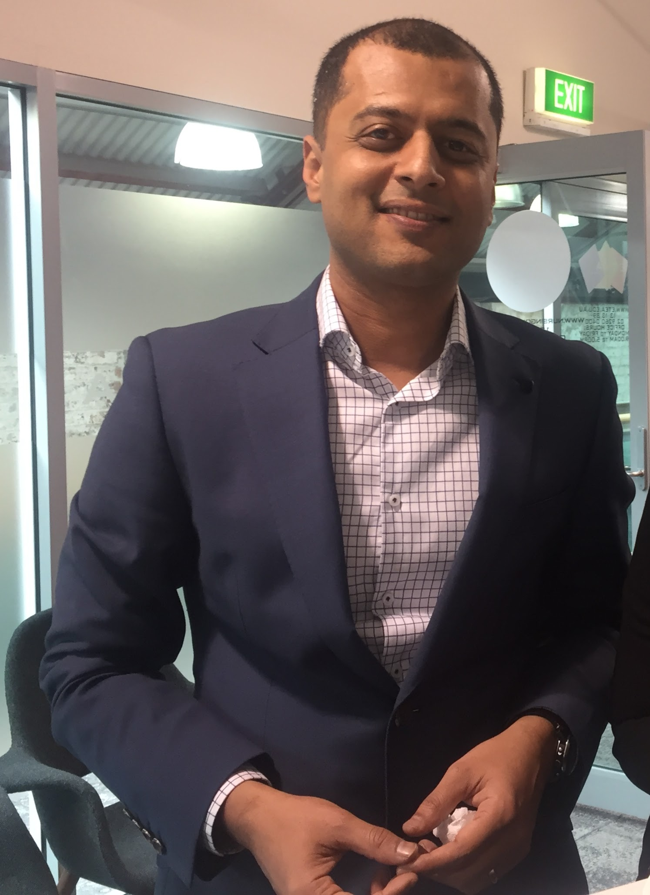

<h1>Personal Information</h1>

Name: Amer Muhammad

  

Student Number: S3728065

  

Email: s3728065@student.rmit.edu.au

                                                

I grew up in a beautiful place called Rahim yar Khan. It is a very small town located in rural Pakistan bordering Indian state of Rajasthan. It is a remote outpost from where rugged terrain extends all the way to Iran and Afghanistan in two directions. Very vibrant multicultural environment where I had a wonderful upbringing, and my childhood and early adolescence memories are filled with happy memories. Growing up in a diverse environment also meant I was fluent in five languages by the time I got to primary school. Once I got to my high school then the realisation hit that opportunities for personal and professional growth are scarce and I had to look elsewhere. I came to Australia after finishing my high school and studied business management. I have held various jobs starting from administration to middle management. For the last four years I have been managing share portfolios as a small business, working part time in management, and studying for a commerce degree with specialising in Financial Planning.

<h1>Interest in IT</h1>

I have always been an avid user of latest gadgets and IT products but without ever putting too much thought into the inner workings or developing a particular interest in them. My interest in IT developed much later in life. In 2016, I set up a small trading and investment proprietary. I was my exposure to share trading platforms and research tools which made me appreciate  how advancements in IT have revolutionised the financial sector. Few years ago, I could only nominate a stock and advise my stockbroker to buy or sell a stock with not many options to view and monitor my holdings in real time.  Now, I have the ability to do research with livestreaming of market data from across the globe, use online tools to factor in micro and macro factors that may impact a share,  and execute trades with a degree of sophistication which enables me to be more efficient and successful.

My interest in IT is also growing because after I obtain my AFSL licence, I am aiming to venture into overseas markets. I will require a deeper knowledge and understanding of cloud-based platforms for better collaboration and the ability to work from anywhere. To maintain the integrity of client data on cloud-based platforms, cybersecurity is going to play a major role in my business model. My experience in IT is predominantly from a user’s perspective, I am running a business which is completely online, I use resources such as IRESS and Thomson Reuters Eikon for research purposes and CommSec to execute most of the trades.
 

I chose RMIT because it was one of the first universities to introduce a fully compliant degree which would enable graduates to obtain Australian financial services licence (AFSL). It was one of the contributing factors among many, RMIT’s online degrees are very well regarded, it is ranked highly by students and has a very high rate of employment for graduates.

I am about to complete my Commerce degree, but I do intend to take additional subjects in IT in areas of cloud computing and cybersecurity. I had no expectations from my first and only Introductory level subject in IT for this degree, but this subject has exceeded my expectations and I am hoping to have learnt basic skills about online platforms like Github, static website hosting on it and working effectively in teams.

Ideal Job
Cyber Security Technical Consultant Job in Sydney - SEEK
</title>
</head>
<body>

