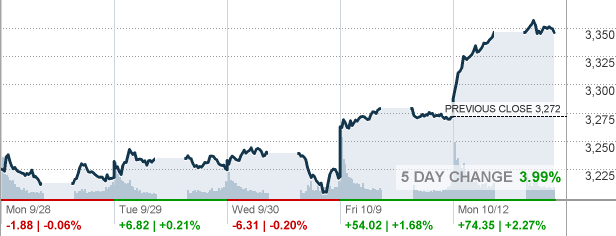

<h1>Personal Information</h1>

Name: Amer Muhammad

  

Student Number: S3728065

  

Email: s3728065@student.rmit.edu.au

                                                

I grew up in a beautiful place called Rahim yar Khan. It is a very small town located in rural Pakistan bordering Indian state of Rajasthan. It is a remote outpost from where rugged terrain extends all the way to Iran and Afghanistan in two directions. Very vibrant multicultural environment where I had a wonderful upbringing, and my childhood and early adolescence memories are filled with happy memories. Growing up in a diverse environment also meant I was fluent in five languages by the time I got to primary school. Once I got to my high school then the realisation hit that opportunities for personal and professional growth are scarce and I had to look elsewhere. I came to Australia after finishing my high school and studied business management. I have held various jobs starting from administration to middle management. For the last four years I have been managing share portfolios as a small business, working part time in management, and studying for a commerce degree with specialising in Financial Planning.

<h1>Interest in IT</h1>

I have always been an avid user of latest gadgets and IT products but without ever putting too much thought into the inner workings or developing a particular interest in them. My interest in IT developed much later in life. In 2016, I set up a small trading and investment proprietary. I was my exposure to share trading platforms and research tools which made me appreciate  how advancements in IT have revolutionised the financial sector. Few years ago, I could only nominate a stock and advise my stockbroker to buy or sell a stock with not many options to view and monitor my holdings in real time.  Now, I have the ability to do research with livestreaming of market data from across the globe, use online tools to factor in micro and macro factors that may impact a share,  and execute trades with a degree of sophistication which enables me to be more efficient and successful.

My interest in IT is also growing because after I obtain my AFSL licence, I am aiming to venture into overseas markets. I will require a deeper knowledge and understanding of cloud-based platforms for better collaboration and the ability to work from anywhere. To maintain the integrity of client data on cloud-based platforms, cybersecurity is going to play a major role in my business model. My experience in IT is predominantly from a user’s perspective, I am running a business which is completely online, I use resources such as IRESS and Thomson Reuters Eikon for research purposes and CommSec to execute most of the trades.
 

I chose RMIT because it was one of the first universities to introduce a fully compliant degree which would enable graduates to obtain Australian financial services licence (AFSL). It was one of the contributing factors among many, RMIT’s online degrees are very well regarded, it is ranked highly by students and has a very high rate of employment for graduates.

I am about to complete my Commerce degree, but I do intend to take additional subjects in IT in areas of cloud computing and cybersecurity. I had no expectations from my first and only Introductory level subject in IT for this degree, but this subject has exceeded my expectations and I am hoping to have learnt basic skills about online platforms like Github, static website hosting on it and working effectively in teams.

<h1>Ideal Job</h1>

<h1>Cyber Security Consultant - Contract Casual Position</h1>

We are seeking a Cyber Security Consultant to join our RiskLogic practice and deliver our key cyber resilience services. This role is a contract position and we are seeking Cyber Security professionals wanting to partner with us and work on a casual contract project basis. 
RiskLogic is a market leading risk consulting company that works with corporate, not-for-profit and government clients throughout Australia and New Zealand. 
Our vision is to work with inspired people to build meaningful organisations that contribute to a better tomorrow. At RiskLogic we do this every day by empowering people to successfully navigate the worst of situations, events like COVID-19, cyber-attacks, terrorism, physical disasters, to name a few. With the right tools, training and experience we help people safeguard what’s important to them, thereby building a more Resilient Future.
This is an awesome role with tremendous scope to make a real impact during an exciting phase of the business. RiskLogic offers a fast paced and results driven environment with competitive remuneration and excellent growth potential.
You will be responsible for the delivery of both operational and strategic client focused solutions, to a diverse range of industries and clients. The Cyber Security Consultant will be responsible for hands on involvement in delivering market-leading cyber security consulting services. You will deliver response procedures and the training and exercising of response teams. 
You are a passionate Cyber Security Expert who can promote a culture of cohesive and responsive service to our clients through effective leadership and a solid track record of delivering relevant services to our clients via best practice advice. 

<h1>Key Responsibilities:</h1>

•	Delivering cyber security consulting services to existing clients
•	Oversee and contribute to client mandates (e.g. procedure development, training and exercising) across cyber security
  
•	Build and maintain strong client relationships across numerous industry sectors

•	Contribute at industry events, seminars and conferences on behalf of RiskLogic

•	Oversee project profitability and other key performance indicators

•	Assist with building local strategic alliances and partnerships

•	Contribute to ongoing quality management and continuous improvement activities

•	Collaborate with other internal divisions to provide integrated client outcomes

•	Be in a position to service clients across Australia, including the occasional interstate travel

<h1>Skills/Experience:</h1>

•	Minimum 3 years' experience in delivering relevant cyber security services, ideally within a consulting environment 
  
•	Minimum 3 years' experience working in IT services, disaster recovery and/or cyber environment

•	Minimum 3 years' experience facilitating training sessions and exercises

•	Demonstrated ability to create, build and maintain strong relationships at all levels

•	Exceptional leadership, project management and organisational skills

•	Ability to problem solve and influence project outcomes

•	A performance driven mindset and strong commercial acumen

•	The ability to adapt to diverse environments and manage multiple priorities

•	Strong presentation, training and facilitation skills

•	A strong drive for continuous improvement and delivery of quality outcomes

•	Self-motivation, with a proven ability to effectively work remotely from managers and other team members

This role takes a holistic approach to cybersecurity including overseeing and contributing towards existing procedures and protocols, developing new ones, deeper engagement with internal and external stakeholders. My particular interest in this role is a comprehensive approach towards cybersecurity issues and broad ranging engagement with industry and collaboration with other professionals. This job is also appealing because it is a contractual role which allows me great deal of flexibility. 

Key skills required for this role are technical skills such as cybersecurity, IT services and data recovery. Other required skills are in project management, leadership, and training. This role also requires 3 years’ experience in areas of cybersecurity consulting, IT services and 3 years’ experience in facilitating training.

I currently have diploma level education in business management and project management. I worked as a team leader for International SOS technical division. I have also overseen learning and development, and staff training for the same organisation.

I will require further education and training in cybersecurity and IT consulting. My existing skills in leadership, project management and training combined with further education will prepare me for positions like these within 2-3 years. My plan is to complete my commerce degree and then take on additional subjects in IT, particularly in cloud computing and cybersecurity. I will do a second degree in IT to prepare me for a potential career in this area.

<h1>Personal Profile</h1>

<h1>Myers-Briggs Test Result</h1>

Type	“The Protagonist” (ENFJ-A)

Traits	Extraverted	-	88%

Intuitive	-	62%

Feeling	-	72%

Judging	-	97%

Assertive	-	89%

Role	Diplomat

Strategy	People Mastery

<h1>Learning Style Result (Education Planner)</h1>

Amer's scores:
  
•	Auditory: 25%

•	Visual: 50%

•	Tactile: 25%

You are a Visual learner!

<h1>Big Five Personality Test Result</h1>

Your results from the IPIP Big Five Factor Markers are in the table below. The table contains a raw score and also a percentile, what percent of other people who have taken this test that you score higher than.

•	Individuals who score high on Factor I one are outgoing and social. Individuals who score low tend to be shut ins.
  
•	A person high in agreeableness is friendly and optimistic. Low scorers are critical and aggressive.

•	Individuals who score high on this factor are careful and diligent. Low scorers are impulsive and disorganized.

•	Factor V is labelled as Intellect/Imagination. This factor is also often called Openness to Experience. People who score low tend to be traditional and conventional.

Test results are mostly accurate in describing personality and other attributes. Mostly they reflect and reenforce what I already have known about myself but the biggest surprise has been scoring high on Judging (97%). These results however, are not going to impact my behaviour in the team because contrary to my Myers Briggs profile, I am very accommodating and respectful of others in a non-judgmental way. In my corporate career, I have been part of small and large teams put together but I have not come across instances where teams were put together or their behaviour was influenced by the personality test results, so these test results will not play any part in team formation unless there is a conflict which is proving difficult to resolve.

<h1>Project Idea</h1>

<h1>Overview</h1>

This project is about developing a share trading app which allows its users access to most of the share markets in the world, both in developed and developing countries. App users will be able to select the target market, choose a company and have access to historical data which enables them to make informed decision whether to invest in securities, and purchase shares by using one single app.

<h1>Motivation</h1>

Investing in overseas markets from Australia is hugely difficult at the moment. One of the most secure and popular apps is the CommSec but it only allows access to Australian Securities Exchange (ASX) and the US markets. Other apps such as Plus500 allows access to most markets but it effectively promotes trading in Contract For Difference (CFD) and other derivatives which are hugely risky and traders don’t end up owning actual securities but only get the difference between opening and closing prices of indices and securities. One of the most popular free apps in Australia is StockLight but it only offers minimal research tools and historical data. Users of StockLight are not able to execute trades from this app. There is a need for an app which integrates research tools and data analysis as well as enabling actual transactions.

In 2014, 36% of the adult Australian population owned investments listed on the share market which equates to 6.48 million Australians owning investments either directly or indirectly . However, Australians investing in overseas markets dwindles to merely 1.6% as compared to the US where nearly 20% of the population invests in overseas markets . Biggest contributing factor in Australians not investing overseas is the lack of easily available financial products through platforms which are easier to access.

<h1>Description</h1>

This app will require users to login by registering and creating an account. User details will be verified through their financial institution in the same way other financial service apps do. Once user logs in, dropdown menu will include options such as “select a market” which will allow user to select a market such ASX or Shanghai Stock Exchange (SSE). Once a market is selected it will show standard chart with current trade levels and status of the market. 
SHANGHAI SE COMPOSITE INDEX 
(Shanghai Stock Exchange:SHCOMP)
Add to Watch List
Set Alert

3,345.92 Delayed Data As of 2:24am ET	  

+73.84 / +2.26% Today’s Change	2,647
TODAY|||52-Week Range 

3,459	+9.72% Year-to-Date 

  

Once a market is selected, submenu will include list of best and worst performers in the market, top 50 companies listed and allow users to search for a company by typing in its name or market code. Once user selects a company, app will display historical data in terms of 1-5-year highs and lows, dividends paid and net market capital. Same screen will also enable users to buy into company shares if they wish to do so. An example from the CommSec below for illustration purposes only.

<h1>WOODSIDE PETROLEUM LTD</h1>

ASX: WPLShare: Energy, Energy
CollapseRefresh Data
Last Price (AUD)$18.350
Today's ChangeDown$0.030 (0.16%)
Buy   Sell
More options
•	Bid / Size$18.330 / 899
  
•	Offer / Size$18.350 / 7,927

•	Volume2,292,579

•	Trades10,194

•	Value$41,900,090.890

•	Open$18.290

•	High$18.350

•	Low$18.150

•	Previous Close$18.380

•	Last Traded4:10:26 PM, 12 Oct 20

•	52 Week High$36.285

•	52 Week Low$14.930

•	ASX StatusAfter Hours Adjust

•	Chi-X StatusClosed

•	Primary MarketAfter Hours Adjust
As of 5:47:24 PM Sydney Time, 12 Oct 2020, Data sourced from ASX TradeMatch and CHI-X.

<h1>Tools and Technologies</h1>

This app will require iOS or Android developers. For iOS, developer will need to be familiar with Swift or Java. For Android developer, Kotlin, or C#. it will further require Backend development such as server technologies, databases, architecture, and software logic. For databases and servers, developers will require knowledge of programming languages such as Ruby, Python, PHP, Java, Net and SQL.
for frontend development for the creation of web interface, developers will require HTML, CSS, and JavaScript. 

<h1>Skills Required</h1>

Skills required for this project include software development, database and server designs and maintenance. Key aspect will be cybersecurity because client data integrity will be paramount given the information stored on database will include financial details and bank accounts for the settlement of trading accounts.

<h1>Outcome</h1>

App will require lot of resources and will need to meet regulatory and licencing requirements in most countries but does have a huge potential. It will transform the way everyday investors buy into overseas equities markets and It will enable Australian investors to access emerging markets such as India and China which have had double digit growths for the past 20 years (not withstanding major economic downturns such Global Financial Crisis GFC or COVID pandemic).

